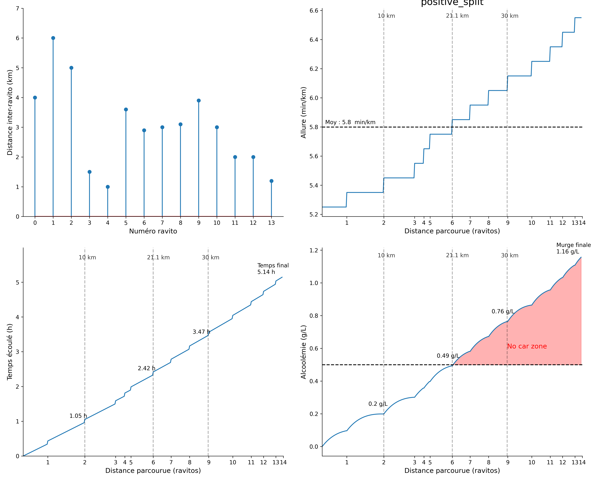
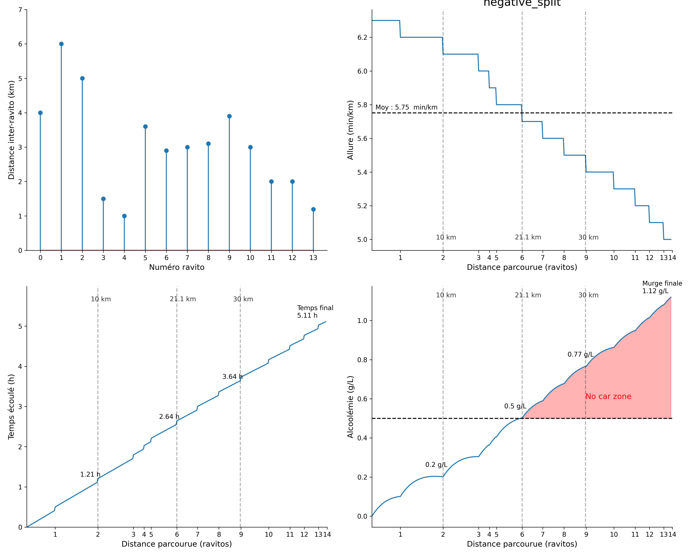
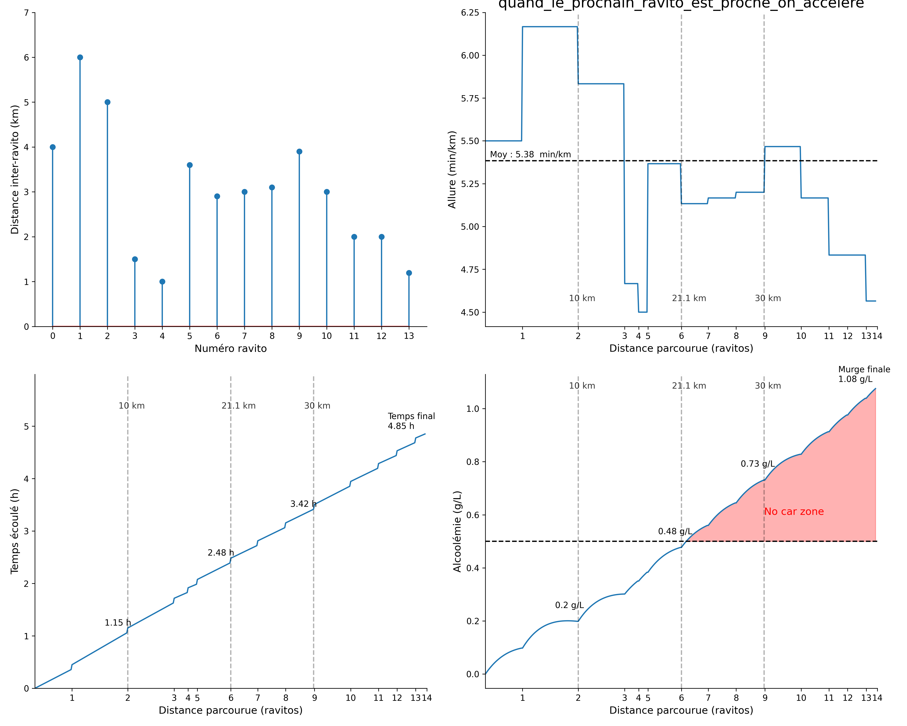

# pacing-plan

Pacing plan for the marathon du beaujolais 2025

------

### Current simulation parameters:
* mean degustation time per ravito : 5min
* mean degustation quantity per ravito : 60 mL (half a glass)
* body mass : 80kg

## Strategy 1 : Positive split
### Purpose 
By observing that the first ravitos are quite afar from each other, the idea is to quickly reach these one and put the crowd at a distance. 
In this scenario, we decrease the pace of 6s (0.1min) after each ravito. 
This plan is also consistent with the evolution of fatigue, dizziness and will to ennjoy along ~~the race~~ the ravitos.

## Strategy 1 : Negative split
### Purpose
Contrarily to the first plan, this dumbass egotic strategy is simply to keep running faster till the end of the race. 
In this scenario, we increase the pace of 6s (0.1min) after each ravito. 
Ok it's actually a fun plan, just run faster despite fatigue and dizziness. 
The main drawback of this strategy is the slow start which means that the first ravitos might be crowded.

## Strategy 3 : The "poulet sans tête" strategy
### Purpose
Also called the "quand le prochain ravito est proche on accelere" strategy, this brain dead strategy consists in running faster when the next ravito.
The trick with this strategy is to finetuned the running paces with the distance to the next ravito. This correlation is here modelled by a linear relationship. 
Given the adjusted paramaters, its the fastest plan of all (<5h race time).

